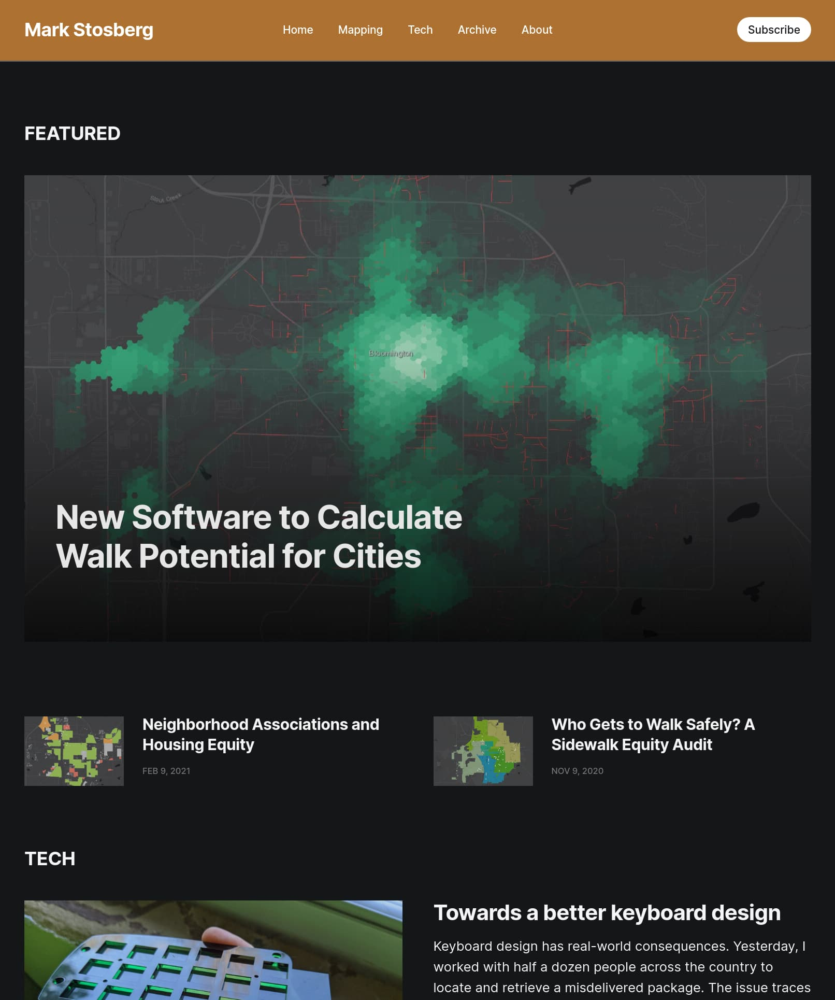
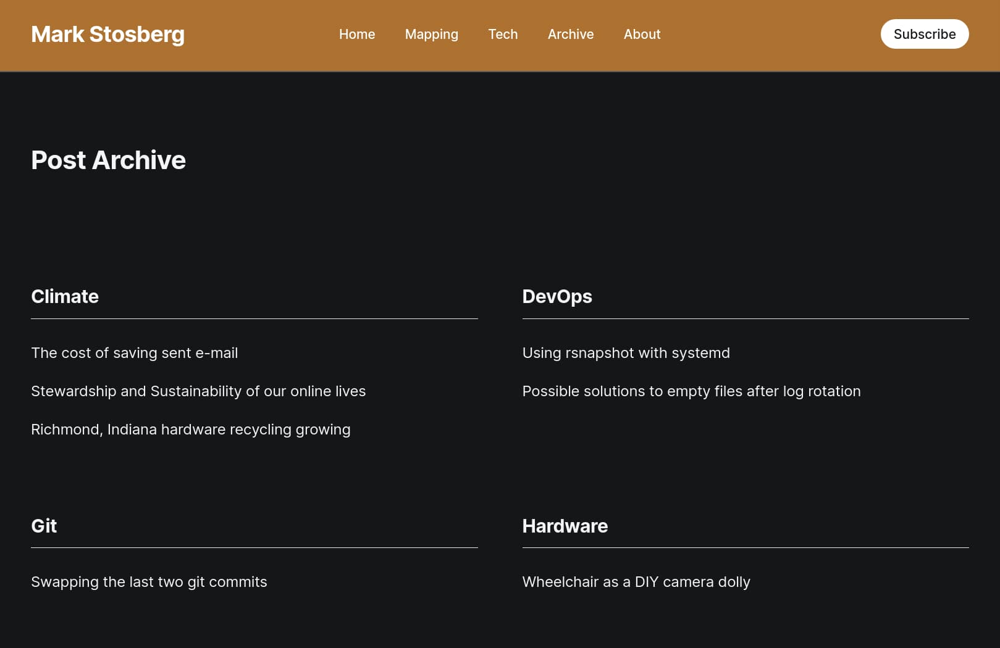

## About headline-markstos

This fork of the headline theme was created to add dark mode as well as other customizations
which make it suitable to use for a personal blog.

 * Featured content rather than Latest content is highlighted on the top of the front page.
   The latest content for different tags still appears below.
 * A custom "archive" page displays all content arranged by tag.
 * Author photos and names are removed from post, since a personal blog has one author.

While the theme free to use, I maintain it for personal use and no compatibility gurantees are made
about future updates.

## Screenshots

### Front Page



### Archive page



## To Enable Dark Mode

After the theme is installed, look under "Site-wide" settings for the theme to select Dark or Auto.

## To use the custom archive page

 * First, follow the usual steps to update your `routes.yaml` file. Example below.
 * Then, update your Navigation in settings to link to it.

```
routes:
  /archive/:
    template: archive
```

## To customize

First, you'll need to checkout the `markstos` branch of this repo.

`git` and `yarn` should already be installed.

    git clone --branch markstos git@github.com:markstos/Themes.git
    cd Themes
    yarn install

Although the theme will appear as `headline-markstos` when installed, it is
stored in the directory named just `headline`, to make it easier for me
to maintain a fork of the headline theme. That's why you see both
names mentioned below.

# run development server
yarn dev
```
Now you can edit files in `packages/headline/assets/css/` or `packages/headlinee/assets/js/`, which will be compiled to `packages/headline/assets/built/` automatically.

To run the theme locally, you need to symlink a theme to your local Ghost site:

```bash
# run a theme locally
yarn symlink --theme headline --site /dir/to/your/ghost-site
```

## To create a zip file of the headline-markstos theme

From the root directory of the Ghost-Themes repo:

    yarn zip --theme=headline

This will produce a zip file at `packages/headline/dist/headline-markstos.zip`

Then it can be uploaded through the Ghost admin area, where it will be recognized as the "headline-markstos" theme.
